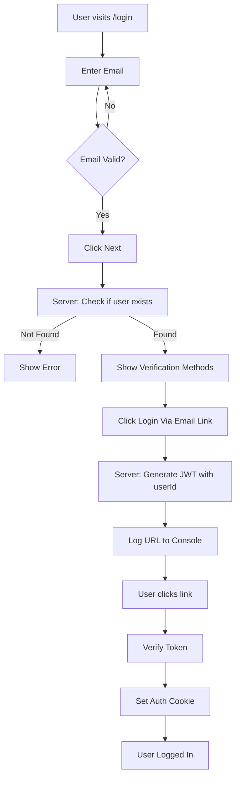

# Login Flow Implementation

## Overview

Build a passwordless login flow that mirrors the registration flow. Users enter their email, receive a verification link (logged to console), and complete login by clicking the link which sets an authentication cookie.

## Architecture Flow

## Implementation Steps

### 1. Update JWT Utilities (`src/lib/jwt.ts`)

Add functions for login link tokens:

- `signLoginLinkToken(userId: number)` - Creates JWT with userId and expiration
- `verifyLoginLinkToken(token: string)` - Verifies and extracts userId from token
- Add `LOGIN_LINK_TOKEN_EXPIRATION` constant (e.g., 1 hour) to `src/lib/constants.ts`

### 2. Update Registration Route (`src/routes/auth/register.$registrationToken.tsx`)

Add cookie setting when user successfully registers:

- Import `setCookie` from `@tanstack/react-start/server`
- After creating user, set cookie: `setCookie('user_id', newUser.id.toString(), { httpOnly: true, secure: process.env.NODE_ENV === 'production', sameSite: 'lax', path: '/', maxAge: 60 * 60 * 24 * 30 })` (30 days)

### 3. Create Login Page (`src/routes/login.tsx`)

- Use TanStack Form with Zod validation
- Single email field with `z.string().email()` validation
- "Next" button enabled only when email is valid (`form.state.isFormValid`)
- On submit: call server function to check if user exists
- Navigate to `/login-verification` with email as search param or state
- Use ShadCN UI components (Field, Input, Button, Label) matching signup page style

**Server Function:**

- Validate email with Zod
- Check if user exists in database by email
- Return `{ exists: boolean, userId?: number }` or throw error if not found

### 4. Create Login Verification Page (`src/routes/login-verification.tsx`)

- Get email from route search params or loader
- Loader: verify user exists, return user data or error
- Display error message if user not found
- If user exists, show verification methods section:
  - Title: "Choose verification method"
  - Button: "Login Via Email Link"
- On button click: call server function to generate login link token
- Server function:
  - Generate JWT token with `signLoginLinkToken(userId)`
  - Build URL: `${baseUrl}/login-via-link/${token}`
  - Log URL to console (same format as registration)
  - Return success

### 5. Create Login Via Link Route (`src/routes/login-via-link.$loginLinkToken.tsx`)

- Dynamic route parameter: `loginLinkToken`
- Loader:
  - Verify token using `verifyLoginLinkToken`
  - Extract userId from token
  - Verify user exists in database
  - Set authentication cookie (same as registration: `user_id` with userId)
  - Return success/error status
- Component:
  - Display "Login Successful" or error message
  - Optionally redirect to home page after successful login

### 6. Cookie Management

Create a utility file `src/lib/auth.ts` for consistent cookie handling:

- `setAuthCookie(userId: number)` - Sets the user_id cookie with consistent options
- `getAuthCookie()` - Gets the user_id cookie
- Cookie name: `'user_id'`
- Cookie options: `{ httpOnly: true, secure: process.env.NODE_ENV === 'production', sameSite: 'lax', path: '/', maxAge: 60 * 60 * 24 * 30 }` (30 days)

## Files to Create/Modify

### New Files:

- `src/routes/login.tsx` - Login page with email form
- `src/routes/login-verification.tsx` - Verification methods page
- `src/routes/login-via-link.$loginLinkToken.tsx` - Login link verification route
- `src/lib/auth.ts` - Cookie management utilities

### Modified Files:

- `src/lib/jwt.ts` - Add login link token functions
- `src/lib/constants.ts` - Add login link token expiration constant
- `src/routes/auth/register.$registrationToken.tsx` - Add cookie setting on registration

## Key Implementation Details

- JWT login link payload: `{ userId: number, exp: number, iat: number }`
- Login link token expiration: 1 hour (shorter than registration token)
- Cookie name: `'user_id'` (string value of userId)
- Cookie expiration: 30 days
- Error handling: User-friendly messages for invalid tokens, expired links, user not found
- UI consistency: Match styling from signup page (dark theme, ShadCN components)
- Server functions use `createServerFn` from `@tanstack/react-start`
- Routes use `createFileRoute` from `@tanstack/react-router`
- Cookie utilities from `@tanstack/react-start/server`

## Testing Considerations

- Test with existing user email (should show verification methods)
- Test with non-existent email (should show error)
- Test login link token expiration (1 hour)
- Test cookie is set correctly after clicking login link
- Test cookie matches registration cookie format
- Verify console logging of login URLs