# Passkey Support Implementation

## Overview

Add passkey (WebAuthn) authentication support to the passwordless login demo app using SimpleWebAuthn. Users can register a single passkey tied to their userId, delete it, and use it for authentication on the login-verification page.

## Architecture Flow

```mermaid
flowchart TD
    subgraph registration[Passkey Registration]
        A1[User Settings Page] --> A2[Click Add Passkey]
        A2 --> A3[Server: Generate Registration Options]
        A3 --> A4[Client: startRegistration]
        A4 --> A5[OS Passkey Dialog]
        A5 --> A6[Server: Verify Registration]
        A6 --> A7[Store Passkey in DB]
        A7 --> A8[Show Success]
    end
    
    subgraph authentication[Passkey Authentication]
        B1[Login Verification Page] --> B2{User has passkey?}
        B2 -->|Yes| B3[Show Login with Passkey Button]
        B2 -->|No| B4[Show Email Link Only]
        B3 --> B5[Server: Generate Auth Options]
        B5 --> B6[Client: startAuthentication]
        B6 --> B7[OS Passkey Dialog]
        B7 --> B8[Server: Verify Authentication]
        B8 --> B9[Set Auth Cookie]
        B9 --> B10[Redirect to User Settings]
    end
```



## Database Schema Changes

Add a new `passkeys` table to `src/db/schema.ts`:

- `id` - integer primary key
- `userId` - integer foreign key to users.id
- `credentialId` - text (base64url encoded credential ID)
- `publicKey` - text (base64url encoded public key)
- `counter` - integer (signature counter for replay protection)
- `transports` - text (JSON array of transport methods: ["usb", "nfc", "ble", "internal"])
- `createdAt` - timestamp

Since we only support a single passkey per user, we'll enforce uniqueness on `userId` at the application level (or add a unique constraint).

## Dependencies to Install

- `@simplewebauthn/server` - Server-side WebAuthn utilities
- `@simplewebauthn/browser` - Client-side WebAuthn utilities
- `@simplewebauthn/typescript` - TypeScript types (optional, but recommended)

## Implementation Steps

### 1. Install Dependencies and Update Database Schema

**Install packages:**

```bash
pnpm add @simplewebauthn/server @simplewebauthn/browser @simplewebauthn/typescript
```

**Update `src/db/schema.ts`:**

- Add `passkeys` table with fields listed above
- Add foreign key relationship to `users` table
- Run `pnpm db:push` to apply schema changes

### 2. Create Passkey Utilities (`src/lib/passkey.ts`)

Create server-side utilities for passkey operations:

- `generateRegistrationOptions(userId: number, userName: string, userDisplayName: string)` - Generate registration options using SimpleWebAuthn's `generateRegistrationOptions()`
  - Use `rpName` from environment or default
  - Use `rpID` from environment (domain without protocol, e.g., "localhost" for dev, "yourdomain.com" for prod)
  - Set `userID` as base64url encoded userId
  - Set `userName` and `userDisplayName`
  - Set `authenticatorSelection` with `residentKey: 'required'` and `userVerification: 'required'`
  - Store challenge temporarily (in-memory Map or session) mapped to userId
  - Return options JSON

- `verifyRegistrationResponse(response: any, expectedChallenge: string, userId: number)` - Verify registration response
  - Use SimpleWebAuthn's `verifyRegistrationResponse()`
  - Extract credential ID, public key, counter, transports from `registrationInfo`
  - Store passkey in database
  - Clean up challenge
  - Return success/error

- `generateAuthenticationOptions(userId: number)` - Generate authentication options
  - Fetch user's passkey from database
  - If no passkey exists, return null
  - Use `generateAuthenticationOptions()` with `allowCredentials` containing the credential ID
  - Store challenge temporarily mapped to userId
  - Return options JSON or null

- `verifyAuthenticationResponse(response: any, expectedChallenge: string, userId: number)` - Verify authentication response
  - Fetch passkey from database
  - Use `verifyAuthenticationResponse()` with stored credential
  - Check signature counter (must be greater than stored counter)
  - Update counter in database
  - Clean up challenge
  - Return success/error

**Challenge Storage:**

- Use an in-memory Map with userId as key and challenge + timestamp as value
- Add cleanup for expired challenges (older than 5 minutes)
- For production, consider using Redis or session storage

### 3. Create PasskeyComponent (`src/components/PasskeyComponent.tsx`)

Create a reusable component for passkey management:

**Props:**

- `userId: number` - Current user's ID
- `hasPasskey: boolean` - Whether user already has a passkey

**Features:**

- Display current passkey status
- "Add Passkey" button (shown when no passkey exists)
- "Delete Passkey" button (shown when passkey exists)
- Loading states during operations
- Error handling and display

**Server Functions:**

- `generatePasskeyRegistrationOptions(userId: number)` - Calls passkey utility to generate options
- `verifyPasskeyRegistration(response: any, userId: number)` - Verifies and saves passkey
- `deletePasskey(userId: number)` - Deletes user's passkey from database
- `generatePasskeyAuthOptions(userId: number)` - Generates authentication options (for login flow)

**Client-side logic:**

- Use `@simplewebauthn/browser`'s `startRegistration()` for registration
- Handle errors gracefully (user cancellation, device not supported, etc.)
- Show appropriate success/error messages

### 4. Update User Settings Page (`src/routes/user-settings.tsx`)

**Loader changes:**

- Query database for user's passkey
- Return `hasPasskey: boolean` and `passkey` data if exists

**Component changes:**

- Add new card section for "Passkey Management"
- Import and render `PasskeyComponent`
- Pass `userId` and `hasPasskey` props

### 5. Update Login Verification Page (`src/routes/login-verification.tsx`)

**Loader changes:**

- Check if user has a passkey
- Return `hasPasskey: boolean` in loader data

**Component changes:**

- Conditionally show "Login with Passkey" button when `hasPasskey` is true
- Add server function `initiatePasskeyLogin(userId: number)` that:
  - Calls `generateAuthenticationOptions(userId)`
  - Returns options JSON
- On button click:
  - Call server function to get auth options
  - Use `@simplewebauthn/browser`'s `startAuthentication()` with options
  - Send response to server for verification
  - On success, redirect to `/user-settings`
- Add server function `verifyPasskeyLogin(response: any, userId: number)` that:
  - Calls `verifyAuthenticationResponse()`
  - On success, calls `setAuthCookie(userId)`
  - Returns success/error

**UI Updates:**

- Show passkey button alongside email link button
- Style consistently with existing UI
- Handle loading states and errors

### 6. Environment Configuration

Add to `.env.example` and document:

- `RP_NAME` - Relying Party name (e.g., "Passwordless Demo")
- `RP_ID` - Relying Party ID (domain without protocol, e.g., "localhost" for dev)
- `ORIGIN` - Expected origin for verification (e.g., "http://localhost:3000" for dev)

Update `src/lib/constants.ts` or create `src/lib/passkey-config.ts`:

- Export `RP_NAME`, `RP_ID`, `ORIGIN` from environment variables with sensible defaults

## Files to Create/Modify

### New Files:

- `src/lib/passkey.ts` - Server-side passkey utilities
- `src/components/PasskeyComponent.tsx` - Passkey management component
- `src/lib/passkey-config.ts` - Passkey configuration constants (optional, can use constants.ts)

### Modified Files:

- `src/db/schema.ts` - Add passkeys table
- `src/routes/user-settings.tsx` - Add PasskeyComponent and passkey data to loader
- `src/routes/login-verification.tsx` - Add passkey login option and server functions
- `package.json` - Add SimpleWebAuthn dependencies
- `.env.example` - Add RP_NAME, RP_ID, ORIGIN

## Key Implementation Details

- **Single Passkey Constraint:** Enforce at application level - check if passkey exists before allowing registration, allow only one passkey per user
- **Challenge Management:** Store challenges in memory with userId as key, include timestamp for cleanup
- **Error Handling:** Handle user cancellation, device not supported, network errors gracefully
- **Security:** 
  - Verify origin and rpID in all verification calls
  - Check signature counter to prevent replay attacks
  - Use secure, unique challenges
- **UI/UX:** 
  - Clear loading states during passkey operations
  - Informative error messages
  - Consistent styling with existing dark theme
- **Type Safety:** Use TypeScript types from `@simplewebauthn/typescript` for better type safety

## Testing Considerations

- Test passkey registration flow end-to-end
- Test passkey deletion
- Test passkey login flow
- Test error cases (user cancellation, invalid credential, etc.)
- Test that only one passkey can be registered per user
- Test signature counter updates
- Verify cookie is set correctly after passkey login
- Test on different browsers/devices (Chrome, Safari, Firefox)

## Notes

- SimpleWebAuthn requires HTTPS in production (or localhost for development)
- The passkey will be stored on the user's device (platform authenticator) or security key
- User verification (biometrics/PIN) is required for both registration and authentication
- The implementation follows SimpleWebAuthn's recommended patterns for security